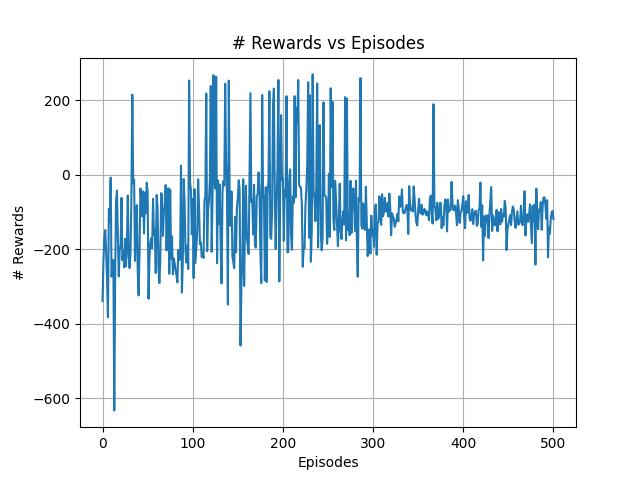
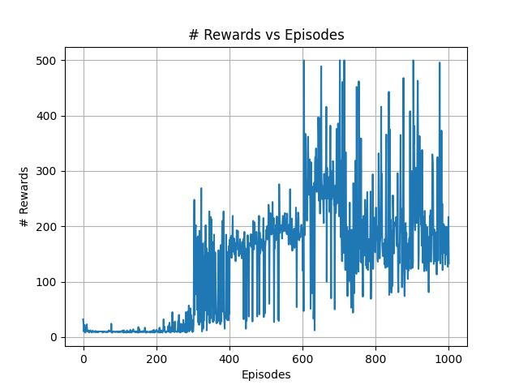

## 🚀️ LunarLander and CartPole - Double Deep Q Learning Algorithm

<div align="center" style="max-width:68rem;">
<table>
  <tr>
    <td align="center"><a href="https://github.com/matheus-1618"><br /><sub><b>Matheus Oliveira</b></sub></a><br /><a href="https://github.com/matheus-1618" title="Matheus Silva M. Oliveira"></a> Developer</td>
   <td align="center"><a href="https://github.com/niveaabreu"><br /><sub><b>Nívea de Abreu</b></sub></a><br /><a href="https://github.com/niveaabreu" title="Nívea de Abreu"></a>Developer</td>
      <td align="center"><a href="https://github.com/leticiacb1"><br /><sub><b>Letícia Côelho</b></sub></a><br /><a href="https://github.com/leticiacb1" title="Letícia Côelho"></a>Developer</td>

  </tr>
</table>
</div>

## 👩‍💻️ To run the models

Installing all the dependencies (create a virtualenv to it):
```python
pip install -r requirements.txt
```

To train our implementation:
```python
python3 LunarLander.py -t -a 1

python3 CartPole.py -t -a 1
```

To run our saved model:
```python
python3 LunarLander.py

python3 CartPole.py
```
## 📌️ Description of the enviroment

The enviroment consist of space ship trying to landing in the moon, between two flags.
The action space consist of 4 actions:
* 0: do nothing

* 1: fire left orientation engine

* 2: fire main engine

* 3: fire right orientation engine

The Observation Space consist of an 8-dimensional vector: the coordinates of the lander in x & y, its linear velocities in x & y, its angle, its angular velocity, and two booleans that represent whether each leg is in contact with the ground or not.

## 📊️ Learning curve
The model presents less oscilations that in the DeepQlearning implementation.


<div align="center" style="max-width:68rem;">
<h1>Lunar Land Curve</h1>

</div>


<div align="center" style="max-width:68rem;">
<h1>CartPole Curve</h1>

</div>

## 🤖️ Behavior of the agent

The agent performed better than in DDQN model than in DQN, mainly because it has segmented netowrks to take an action and evaluate the Q values.

